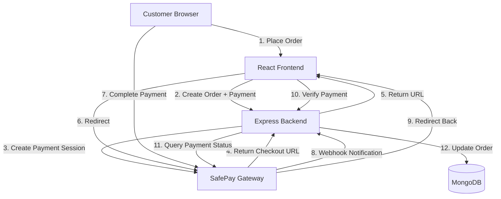
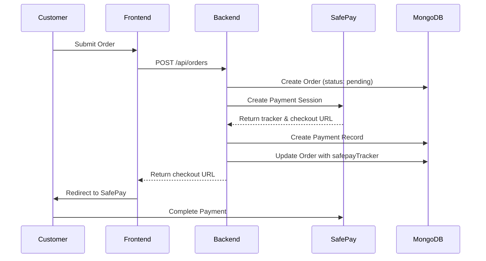
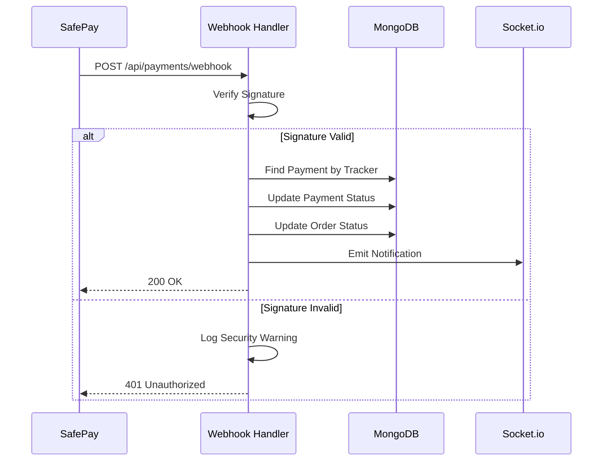
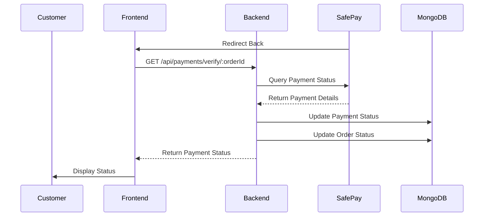
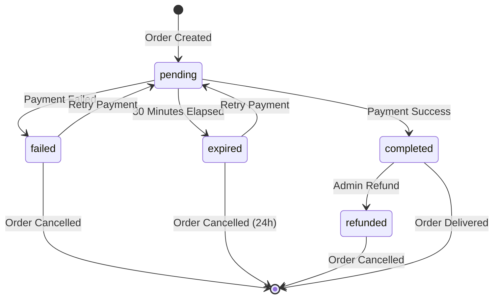
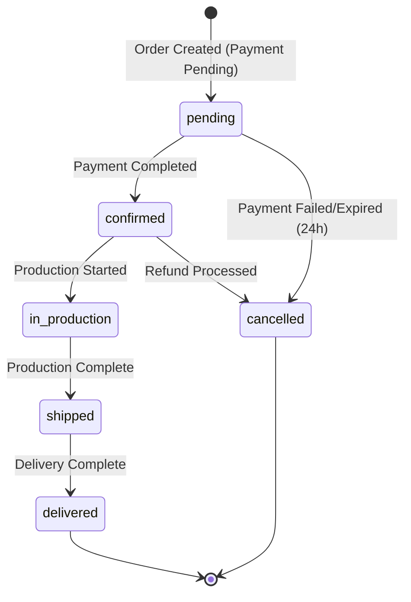

# Design Document: SafePay Payment Integration

## Overview

This design document specifies the technical architecture for integrating SafePay payment gateway into the Fashion House (Lehnga Vault) e-commerce application. The integration enables secure online payment processing for both ready-made and customized lehnga orders.

### System Context

The Fashion House application is a full-stack e-commerce platform built with:
- **Backend**: Node.js with Express.js framework, MongoDB database, Socket.io for real-time notifications
- **Frontend**: React with React Router, Axios for HTTP requests, react-toastify for notifications
- **Existing Infrastructure**: User authentication (JWT), order management, product catalog, admin dashboard

### Integration Scope

The SafePay integration will:
1. Create payment sessions when customers place orders
2. Redirect customers to SafePay's hosted checkout page
3. Receive and verify webhook notifications for payment status updates
4. Verify payment status through SafePay API queries
5. Update order status based on payment completion
6. Provide payment visibility to customers and administrators
7. Support payment retry for failed transactions
8. Handle refunds through SafePay API

### Key Design Principles

1. **Security First**: All payment credentials stored in environment variables, webhook signature verification, no sensitive data in client code
2. **Idempotency**: Webhook handlers process duplicate notifications safely
3. **Eventual Consistency**: Payment verification fallback ensures status accuracy even if webhooks fail
4. **User Experience**: Clear payment status visibility, helpful error messages, seamless checkout flow
5. **Auditability**: Comprehensive logging of all payment operations for compliance and troubleshooting


## Architecture

### High-Level Architecture



### Component Architecture

The integration consists of five main components:

1. **Payment Service** (`backend/services/paymentService.js`)
   - Encapsulates SafePay SDK interactions
   - Creates payment sessions
   - Verifies payment status
   - Initiates refunds
   - Validates payment data

2. **Payment Model** (`backend/models/Payment.js`)
   - Stores payment transaction records
   - Links payments to orders
   - Maintains payment history and audit trail

3. **Payment Controller** (`backend/controllers/paymentController.js`)
   - Handles HTTP requests for payment operations
   - Processes webhook notifications
   - Manages payment verification
   - Coordinates order status updates

4. **Payment Routes** (`backend/routes/paymentRoutes.js`)
   - Defines API endpoints for payment operations
   - Webhook endpoint (public, no authentication)
   - Payment verification endpoint (authenticated)
   - Refund endpoint (admin only)

5. **Frontend Payment Components**
   - `CheckoutPage.js`: Displays order summary and initiates payment
   - `PaymentStatus.js`: Shows payment status after redirect
   - `OrderDetails.js`: Enhanced to display payment information
   - `AdminPayments.js`: Admin dashboard for payment management


### Payment Flow Sequence

#### Order Creation and Payment Initiation



#### Webhook Processing



#### Payment Verification




## Components and Interfaces

### Backend Components

#### 1. Payment Service (`backend/services/paymentService.js`)

**Purpose**: Encapsulates all SafePay SDK interactions and payment business logic.

**Dependencies**:
- `@sfpy/node-sdk`: SafePay Node.js SDK
- `Payment` model
- `Order` model

**Key Methods**:

```javascript
class PaymentService {
  constructor() {
    // Initialize SafePay client with credentials from environment
    this.safepay = new SafePay({
      environment: process.env.SAFEPAY_ENVIRONMENT, // 'sandbox' or 'production'
      apiKey: process.env.SAFEPAY_API_KEY,
      secretKey: process.env.SAFEPAY_SECRET_KEY
    });
  }

  async createPaymentSession(orderId, amount, currency = 'PKR')
  async verifyPaymentStatus(tracker)
  async initiateRefund(tracker, amount, reason)
  verifyWebhookSignature(signature, timestamp, body)
  validatePaymentData(amount, orderId, currency)
}
```

**Method Specifications**:

- `createPaymentSession(orderId, amount, currency)`: Creates a SafePay payment session
  - **Input**: Order ID (ObjectId), amount (number), currency (string, default 'PKR')
  - **Output**: `{ tracker, checkoutUrl, expiresAt }`
  - **Errors**: Throws if validation fails or SafePay API error

- `verifyPaymentStatus(tracker)`: Queries SafePay API for payment status
  - **Input**: SafePay tracker ID (string)
  - **Output**: `{ status, transactionId, paymentMethod, amount, timestamp }`
  - **Errors**: Throws if tracker invalid or API error

- `initiateRefund(tracker, amount, reason)`: Initiates refund through SafePay
  - **Input**: Tracker ID, refund amount, reason string
  - **Output**: `{ refundId, status, timestamp }`
  - **Errors**: Throws if refund fails

- `verifyWebhookSignature(signature, timestamp, body)`: Verifies webhook authenticity
  - **Input**: Signature header, timestamp header, raw request body
  - **Output**: Boolean (true if valid)
  - **Implementation**: HMAC-SHA256 verification using base64-decoded secret


#### 2. Payment Controller (`backend/controllers/paymentController.js`)

**Purpose**: Handles HTTP requests for payment operations.

**Key Functions**:

```javascript
// Create payment session when order is placed
exports.createPayment = async (req, res, next)

// Webhook endpoint to receive SafePay notifications
exports.handleWebhook = async (req, res, next)

// Verify payment status after customer returns
exports.verifyPayment = async (req, res, next)

// Initiate refund (admin only)
exports.initiateRefund = async (req, res, next)

// Get payment details for an order
exports.getPaymentByOrder = async (req, res, next)

// Get all payments (admin only, with filters)
exports.getAllPayments = async (req, res, next)

// Retry payment for failed transaction
exports.retryPayment = async (req, res, next)
```

**Function Specifications**:

- `createPayment`: Called internally when order is created
  - **Input**: `{ orderId, amount, currency }`
  - **Process**: Validate data → Create payment session → Save payment record → Return checkout URL
  - **Response**: `{ success: true, checkoutUrl, tracker, expiresAt }`

- `handleWebhook`: Public endpoint for SafePay webhooks
  - **Input**: Webhook payload in request body, signature in headers
  - **Process**: Verify signature → Extract tracker → Update payment status → Update order status → Emit Socket.io notification
  - **Response**: `200 OK` or `401 Unauthorized`
  - **Idempotency**: Check if payment already processed before updating

- `verifyPayment`: Called when customer returns from SafePay
  - **Input**: Order ID in URL params
  - **Process**: Query SafePay API → Update payment status → Update order status
  - **Response**: `{ success: true, payment: {...}, order: {...} }`

- `initiateRefund`: Admin initiates refund
  - **Input**: `{ orderId, amount, reason }`
  - **Process**: Validate order → Call SafePay refund API → Update payment status → Update order status → Send notification
  - **Response**: `{ success: true, refund: {...} }`


#### 3. Payment Routes (`backend/routes/paymentRoutes.js`)

**API Endpoints**:

| Method | Endpoint | Auth | Description |
|--------|----------|------|-------------|
| POST | `/api/payments/webhook` | None (signature verified) | Receive SafePay webhook notifications |
| GET | `/api/payments/verify/:orderId` | Customer/Admin | Verify payment status for an order |
| POST | `/api/payments/refund` | Admin only | Initiate refund for a payment |
| GET | `/api/payments/order/:orderId` | Customer/Admin | Get payment details for an order |
| GET | `/api/payments` | Admin only | Get all payments with filters |
| POST | `/api/payments/retry/:orderId` | Customer/Admin | Retry payment for failed transaction |

**Route Configuration**:

```javascript
const express = require('express');
const router = express.Router();
const paymentController = require('../controllers/paymentController');
const { protect, authorize } = require('../middleware/authMiddleware');

// Public webhook endpoint (no auth, signature verified in controller)
router.post('/webhook', paymentController.handleWebhook);

// Customer/Admin endpoints
router.get('/verify/:orderId', protect, paymentController.verifyPayment);
router.get('/order/:orderId', protect, paymentController.getPaymentByOrder);
router.post('/retry/:orderId', protect, paymentController.retryPayment);

// Admin-only endpoints
router.post('/refund', protect, authorize('superadmin', 'inventoryManager'), paymentController.initiateRefund);
router.get('/', protect, authorize('superadmin', 'inventoryManager'), paymentController.getAllPayments);

module.exports = router;
```

**Webhook Endpoint Security**:
- No JWT authentication (SafePay cannot send JWT tokens)
- Signature verification using HMAC-SHA256
- Rate limiting: 100 requests per minute per IP
- Request body size limit: 1MB
- Raw body parsing required for signature verification


#### 4. Order Controller Enhancement

**Modified Functions**:

```javascript
// Enhanced createOrder to include payment session creation
exports.createOrder = async (req, res, next) => {
  // 1. Validate order data
  // 2. Create order with status 'pending'
  // 3. Create payment session via PaymentService
  // 4. Update order with safepayTracker
  // 5. Return order and checkout URL
}

// Enhanced getOrderById to include payment information
exports.getOrderById = async (req, res, next) => {
  // Populate payment field when returning order
}

// Enhanced updateOrderStatus to check payment status
exports.updateOrderStatus = async (req, res, next) => {
  // Prevent status change to 'confirmed' if payment not completed
}
```

### Frontend Components

#### 1. CheckoutPage Component (`frontend/src/pages/CheckoutPage.js`)

**Purpose**: Display order summary and initiate payment flow.

**Props**: None (uses React Router params to get order ID)

**State**:
```javascript
{
  order: null,
  loading: true,
  error: null,
  redirecting: false
}
```

**Key Functions**:
- `fetchOrderDetails()`: Load order and payment information
- `handlePayment()`: Redirect to SafePay checkout URL
- `handleCancel()`: Return to order summary

**UI Elements**:
- Order summary (product, size, quantity, total)
- Shipping address display
- Payment amount breakdown
- "Proceed to Payment" button
- "Cancel" button
- Loading spinner during redirect


#### 2. PaymentStatus Component (`frontend/src/pages/PaymentStatus.js`)

**Purpose**: Display payment status after customer returns from SafePay.

**Props**: None (uses React Router params and query params)

**State**:
```javascript
{
  payment: null,
  order: null,
  loading: true,
  error: null,
  verifying: true
}
```

**Key Functions**:
- `verifyPayment()`: Call backend to verify payment status
- `handleRetry()`: Retry payment if failed
- `navigateToOrders()`: Go to My Orders page

**UI Elements**:
- Success state: Checkmark icon, success message, transaction ID, order details, "View My Orders" button
- Failed state: Error icon, error message, retry button, support contact
- Pending state: Loading spinner, "Verifying payment..." message
- Expired state: Warning icon, expiration message, retry button

#### 3. OrderDetails Component Enhancement

**Additional State**:
```javascript
{
  payment: null,
  showRefundModal: false
}
```

**New UI Elements**:
- Payment status badge (color-coded)
- Transaction ID display
- Payment method display
- Payment timestamp
- "Retry Payment" button (if failed/expired)
- "Complete Payment" button (if pending)
- "Refund" button (admin only, if completed)

#### 4. AdminPayments Component (`frontend/src/pages/admin/AdminPayments.js`)

**Purpose**: Admin dashboard for payment management.

**State**:
```javascript
{
  payments: [],
  filters: {
    status: 'all',
    dateFrom: null,
    dateTo: null,
    searchQuery: ''
  },
  analytics: {
    totalRevenue: 0,
    successRate: 0,
    pendingCount: 0,
    completedCount: 0,
    failedCount: 0
  },
  loading: true,
  selectedPayment: null
}
```

**Key Functions**:
- `fetchPayments()`: Load payments with filters
- `fetchAnalytics()`: Load payment analytics
- `handleRefund()`: Initiate refund
- `exportPayments()`: Export payment data to CSV

**UI Elements**:
- Analytics cards (revenue, success rate, counts)
- Revenue chart (daily for past 30 days)
- Filters (status, date range, search)
- Payments table (order ID, customer, amount, status, date, actions)
- Payment details modal
- Refund modal


## Data Models

### Payment Model (`backend/models/Payment.js`)

```javascript
const paymentSchema = new mongoose.Schema({
  order: {
    type: mongoose.Schema.Types.ObjectId,
    ref: 'Order',
    required: true,
    index: true
  },
  
  safepayTracker: {
    type: String,
    required: true,
    unique: true,
    index: true
  },
  
  amount: {
    type: Number,
    required: true,
    min: 0
  },
  
  currency: {
    type: String,
    required: true,
    default: 'PKR',
    enum: ['PKR']
  },
  
  status: {
    type: String,
    required: true,
    enum: ['pending', 'completed', 'failed', 'expired', 'refunded', 'verification-failed'],
    default: 'pending',
    index: true
  },
  
  transactionId: {
    type: String,
    default: null
  },
  
  paymentMethod: {
    type: String,
    default: null
  },
  
  checkoutUrl: {
    type: String,
    required: true
  },
  
  expiresAt: {
    type: Date,
    required: true,
    index: true
  },
  
  completedAt: {
    type: Date,
    default: null
  },
  
  refund: {
    refundId: String,
    amount: Number,
    reason: String,
    initiatedBy: {
      type: mongoose.Schema.Types.ObjectId,
      ref: 'User'
    },
    refundedAt: Date
  },
  
  attempts: [{
    timestamp: {
      type: Date,
      default: Date.now
    },
    status: String,
    errorMessage: String
  }],
  
  webhookEvents: [{
    eventType: String,
    receivedAt: {
      type: Date,
      default: Date.now
    },
    payload: mongoose.Schema.Types.Mixed
  }]
}, {
  timestamps: true
});

// Index for finding expired payments
paymentSchema.index({ status: 1, expiresAt: 1 });

// Index for finding stale pending payments
paymentSchema.index({ status: 1, createdAt: 1 });

// Virtual for checking if payment is expired
paymentSchema.virtual('isExpired').get(function() {
  return this.status === 'pending' && new Date() > this.expiresAt;
});

// Method to add payment attempt
paymentSchema.methods.addAttempt = function(status, errorMessage = null) {
  this.attempts.push({ status, errorMessage });
  return this.save();
};

// Method to add webhook event
paymentSchema.methods.addWebhookEvent = function(eventType, payload) {
  this.webhookEvents.push({ eventType, payload });
  return this.save();
};

module.exports = mongoose.model('Payment', paymentSchema);
```


### Order Model Enhancement

**New Fields to Add**:

```javascript
// Add to existing orderSchema
{
  payment: {
    type: mongoose.Schema.Types.ObjectId,
    ref: 'Payment',
    default: null
  },
  
  paymentStatus: {
    type: String,
    enum: ['pending', 'completed', 'failed', 'expired', 'refunded'],
    default: 'pending',
    index: true
  },
  
  safepayTracker: {
    type: String,
    default: null,
    index: true
  }
}
```

**Modified Status Transition Rules**:

```javascript
// Add validation middleware
orderSchema.pre('save', function(next) {
  // Prevent status change to 'confirmed' if payment not completed
  if (this.isModified('status') && this.status === 'confirmed') {
    if (this.paymentStatus !== 'completed') {
      return next(new Error('Cannot confirm order without completed payment'));
    }
  }
  next();
});
```

### PaymentLog Model (`backend/models/PaymentLog.js`)

**Purpose**: Audit trail for all payment operations.

```javascript
const paymentLogSchema = new mongoose.Schema({
  payment: {
    type: mongoose.Schema.Types.ObjectId,
    ref: 'Payment',
    required: true,
    index: true
  },
  
  operation: {
    type: String,
    required: true,
    enum: [
      'session_created',
      'webhook_received',
      'verification_attempted',
      'verification_succeeded',
      'verification_failed',
      'refund_initiated',
      'refund_completed',
      'status_updated'
    ]
  },
  
  details: {
    type: mongoose.Schema.Types.Mixed,
    required: true
  },
  
  performedBy: {
    type: mongoose.Schema.Types.ObjectId,
    ref: 'User',
    default: null
  },
  
  ipAddress: {
    type: String,
    default: null
  },
  
  userAgent: {
    type: String,
    default: null
  }
}, {
  timestamps: true
});

// Index for querying logs by payment and date
paymentLogSchema.index({ payment: 1, createdAt: -1 });

module.exports = mongoose.model('PaymentLog', paymentLogSchema);
```


## Error Handling

### Error Categories

#### 1. Payment Session Creation Errors

**Validation Errors**:
- Invalid amount (zero or negative)
- Invalid order ID format
- Invalid currency
- Missing required fields

**Response**: `400 Bad Request` with descriptive message

**SafePay API Errors**:
- Authentication failure (invalid credentials)
- Rate limit exceeded
- Service unavailable

**Response**: `502 Bad Gateway` with user-friendly message

**Handling Strategy**:
```javascript
try {
  const session = await paymentService.createPaymentSession(orderId, amount, currency);
  // Success path
} catch (error) {
  if (error.name === 'ValidationError') {
    return res.status(400).json({ message: error.message });
  }
  if (error.name === 'SafePayAPIError') {
    // Log error details
    logger.error('SafePay API Error:', error);
    return res.status(502).json({ 
      message: 'Payment service temporarily unavailable. Please try again.' 
    });
  }
  // Generic error
  return res.status(500).json({ message: 'Failed to create payment session' });
}
```

#### 2. Webhook Processing Errors

**Signature Verification Failure**:
- Invalid signature
- Missing signature header
- Timestamp too old (replay attack)

**Response**: `401 Unauthorized`, log security warning

**Payload Processing Errors**:
- Invalid JSON
- Missing required fields
- Unknown event type

**Response**: `400 Bad Request`

**Database Errors**:
- Payment not found
- Order not found
- Update conflict

**Response**: `200 OK` (to prevent retry), log error for manual review

**Handling Strategy**:
```javascript
// Always respond quickly to prevent timeout
try {
  // Verify signature first
  if (!paymentService.verifyWebhookSignature(signature, timestamp, body)) {
    logger.warn('Invalid webhook signature', { ip: req.ip });
    return res.status(401).json({ message: 'Invalid signature' });
  }
  
  // Process webhook asynchronously
  processWebhookAsync(payload);
  
  // Respond immediately
  return res.status(200).json({ received: true });
} catch (error) {
  logger.error('Webhook processing error:', error);
  return res.status(200).json({ received: true }); // Prevent retry
}
```


#### 3. Payment Verification Errors

**SafePay API Errors**:
- Invalid tracker ID
- Payment not found
- API timeout

**Handling Strategy**: Retry up to 3 times with exponential backoff

```javascript
async function verifyPaymentWithRetry(tracker, maxRetries = 3) {
  for (let attempt = 1; attempt <= maxRetries; attempt++) {
    try {
      const result = await paymentService.verifyPaymentStatus(tracker);
      return result;
    } catch (error) {
      if (attempt === maxRetries) {
        throw new Error('Payment verification failed after retries');
      }
      await sleep(Math.pow(2, attempt) * 1000); // Exponential backoff
    }
  }
}
```

#### 4. Refund Errors

**Business Logic Errors**:
- Payment not completed
- Already refunded
- Refund amount exceeds payment amount

**Response**: `400 Bad Request` with specific message

**SafePay API Errors**:
- Refund not allowed (payment too old)
- Insufficient merchant balance
- API error

**Response**: `502 Bad Gateway` with user-friendly message

### Error Messages

**User-Facing Error Messages**:

| Error Scenario | Message |
|----------------|---------|
| Insufficient funds | "Payment declined - insufficient funds. Please try a different payment method." |
| Network timeout | "Payment timed out. Please try again." |
| Invalid card details | "Invalid payment details. Please check your information and try again." |
| Session expired | "Payment session expired. Please place your order again." |
| Payment service down | "Payment service temporarily unavailable. Please try again in a few minutes." |
| Verification failed | "Unable to verify payment status. Our team has been notified and will update your order shortly." |

**Admin-Facing Error Messages**:

| Error Scenario | Message |
|----------------|---------|
| Refund failed | "Refund failed: [specific reason]. Please contact SafePay support." |
| Webhook signature invalid | "Invalid webhook signature from IP [address]. Possible security issue." |
| Payment recovery failed | "Unable to recover payment status for order [ID]. Manual review required." |


## Testing Strategy

### Unit Testing

**Backend Unit Tests**:

1. **Payment Service Tests** (`tests/services/paymentService.test.js`)
   - Test payment session creation with valid data
   - Test payment session creation with invalid data (amount, currency, order ID)
   - Test webhook signature verification with valid signature
   - Test webhook signature verification with invalid signature
   - Test payment status verification
   - Test refund initiation
   - Mock SafePay SDK responses

2. **Payment Controller Tests** (`tests/controllers/paymentController.test.js`)
   - Test createPayment endpoint with valid order
   - Test handleWebhook with valid signature
   - Test handleWebhook with invalid signature
   - Test verifyPayment endpoint
   - Test initiateRefund endpoint
   - Test getPaymentByOrder endpoint
   - Mock PaymentService methods

3. **Payment Model Tests** (`tests/models/Payment.test.js`)
   - Test payment creation with required fields
   - Test payment validation (amount, currency, status)
   - Test addAttempt method
   - Test addWebhookEvent method
   - Test isExpired virtual property

4. **Order Model Tests** (`tests/models/Order.test.js`)
   - Test order status transition validation
   - Test prevention of confirmation without completed payment

**Frontend Unit Tests**:

1. **CheckoutPage Tests** (`tests/pages/CheckoutPage.test.js`)
   - Test order details display
   - Test payment button click
   - Test cancel button navigation
   - Test loading states
   - Mock API calls

2. **PaymentStatus Tests** (`tests/pages/PaymentStatus.test.js`)
   - Test success state display
   - Test failed state display
   - Test pending state display
   - Test retry button functionality
   - Mock API calls

3. **AdminPayments Tests** (`tests/pages/admin/AdminPayments.test.js`)
   - Test payments list display
   - Test filters functionality
   - Test analytics display
   - Test refund modal
   - Mock API calls


### Integration Testing

**Backend Integration Tests**:

1. **Payment Flow Integration Test**
   - Create order → Create payment session → Verify session created
   - Simulate webhook → Verify payment status updated → Verify order status updated
   - Verify payment → Confirm status matches webhook

2. **Webhook Security Integration Test**
   - Send webhook with valid signature → Verify accepted
   - Send webhook with invalid signature → Verify rejected
   - Send duplicate webhook → Verify idempotent processing

3. **Payment Recovery Integration Test**
   - Create payment with pending status
   - Wait for recovery job to run
   - Verify payment status queried from SafePay
   - Verify status updated correctly

4. **Refund Flow Integration Test**
   - Create completed payment
   - Initiate refund
   - Verify refund status updated
   - Verify order status updated

**Frontend Integration Tests**:

1. **Checkout Flow Test**
   - Navigate to checkout page
   - Verify order details displayed
   - Click payment button
   - Verify redirect to SafePay URL

2. **Payment Return Flow Test**
   - Simulate return from SafePay
   - Verify payment verification called
   - Verify status displayed correctly
   - Verify navigation to orders page

### End-to-End Testing

**E2E Test Scenarios**:

1. **Successful Payment Flow**
   - User places order
   - User redirected to SafePay
   - User completes payment
   - Webhook received and processed
   - User redirected back
   - Payment verified
   - Order status updated to confirmed
   - User sees success message

2. **Failed Payment Flow**
   - User places order
   - User redirected to SafePay
   - Payment fails
   - Webhook received
   - User redirected back
   - User sees error message
   - User clicks retry
   - New payment session created

3. **Expired Payment Flow**
   - User places order
   - Payment session expires (30 minutes)
   - Recovery job detects expired payment
   - Payment status updated to expired
   - User receives notification

4. **Refund Flow**
   - Admin views completed order
   - Admin initiates refund
   - Refund processed through SafePay
   - Payment status updated to refunded
   - Order status updated to cancelled
   - Customer receives notification


### Testing with SafePay Sandbox

**Sandbox Configuration**:
```env
SAFEPAY_ENVIRONMENT=sandbox
SAFEPAY_API_KEY=sandbox_api_key_here
SAFEPAY_SECRET_KEY=sandbox_secret_key_here
SAFEPAY_WEBHOOK_URL=https://your-domain.com/api/payments/webhook
```

**Test Cards** (provided by SafePay):
- Success: Use SafePay sandbox test card numbers
- Failure: Use specific test card numbers that trigger failures
- Timeout: Use test card numbers that simulate timeouts

**Webhook Testing**:
- Use ngrok to expose local webhook endpoint: `ngrok http 5000`
- Your current ngrok URL: `https://exclusion-sepia-nicotine.ngrok-free.dev`
- Configure webhook URL in SafePay sandbox dashboard: `https://exclusion-sepia-nicotine.ngrok-free.dev/api/payments/webhook`
- Test webhook delivery and signature verification
- **Note**: ngrok URLs change on restart - update SafePay dashboard when URL changes

**Manual Testing Checklist**:
- [ ] Create order and verify payment session created
- [ ] Complete payment in sandbox and verify webhook received
- [ ] Verify payment status updated correctly
- [ ] Test failed payment scenario
- [ ] Test expired payment scenario
- [ ] Test payment retry functionality
- [ ] Test refund functionality
- [ ] Test admin payment dashboard
- [ ] Test payment analytics
- [ ] Test Socket.io notifications
- [ ] Test email notifications


## Correctness Properties

*A property is a characteristic or behavior that should hold true across all valid executions of a system—essentially, a formal statement about what the system should do. Properties serve as the bridge between human-readable specifications and machine-verifiable correctness guarantees.*

## Property Reflection

After analyzing all acceptance criteria, I identified the following property-based test candidates and performed reflection to eliminate redundancy:

**Redundancy Analysis**:
- Properties 2.2, 2.3, 2.4, 2.5 all relate to payment session creation and can be combined into a comprehensive "Payment session creation completeness" property
- Properties 4.4 and 4.5 (webhook status updates) are similar patterns and can be generalized into one property about webhook processing
- Properties 5.2 and 5.3 overlap with verification logic and can be combined
- Properties 6.1 and 6.7 both relate to data persistence and logging, can be combined into comprehensive storage property
- Properties 10.1 and 10.2 relate to retry session management and can be combined
- Properties 12.2, 12.3, 12.4 form a refund flow that can be combined into one comprehensive property
- Properties 13.1, 13.2, 13.4, 13.5 all relate to notifications and can be combined into notification property
- Properties 15.1 and 15.3 both enforce payment requirement for customized orders, can be combined
- Properties 17.1 and 17.2 relate to session expiration and can be combined

After reflection, the following unique properties provide comprehensive coverage without redundancy:


### Property 1: Payment Session Creation Completeness

*For any* valid order with amount, currency, and order reference, creating a payment session SHALL return a complete session object containing a unique tracker ID, a valid SafePay checkout URL, PKR as currency, the correct order reference, and an expiration time of exactly 30 minutes from creation.

**Validates: Requirements 2.2, 2.3, 2.4, 2.5, 17.1**

### Property 2: Webhook Signature Verification

*For any* webhook payload and timestamp, computing the HMAC-SHA256 signature using the base64-decoded secret key over `timestamp + '.' + raw_body` SHALL produce a signature that matches the expected format `sha256=<hex_digest>`, and verification SHALL succeed only when the computed signature matches the provided signature.

**Validates: Requirements 4.2, 11.2**

### Property 3: Webhook Idempotency

*For any* valid webhook notification, processing the same webhook multiple times SHALL result in the same final payment and order status as processing it once, with no duplicate side effects.

**Validates: Requirements 4.8**

### Property 4: Webhook Status Propagation

*For any* payment with a valid webhook indicating status change (completed or failed), the payment status SHALL update to match the webhook event type, and if the new status is "completed", the associated order status SHALL transition from "pending" to "confirmed".

**Validates: Requirements 4.4, 4.5, 4.6**

### Property 5: Payment Verification Correctness

*For any* payment with a SafePay tracker ID, querying the SafePay API for payment status SHALL use the correct tracker ID, and when the API returns a status, the payment record SHALL update to match the API response status.

**Validates: Requirements 5.2, 5.3**

### Property 6: Payment Data Persistence

*For any* payment transaction, the system SHALL store all required fields (status, transaction ID, payment method, amount, timestamp) in the database, and SHALL create audit log entries for all payment operations (session creation, webhook receipt, verification, refund) with complete details.

**Validates: Requirements 6.1, 6.7, 19.1, 19.2, 19.3, 19.4**

### Property 7: Payment Status Enum Validity

*For any* payment status update, the new status SHALL be one of the valid enum values: pending, completed, failed, expired, refunded, or verification-failed.

**Validates: Requirements 6.3**


### Property 8: Order Confirmation Payment Requirement

*For any* order, the system SHALL prevent status transition from "pending" to "confirmed" unless the associated payment status is "completed", ensuring orders cannot be confirmed without successful payment.

**Validates: Requirements 7.4**

### Property 9: Order Initialization

*For any* newly created order, the paymentStatus field SHALL be initialized to "pending".

**Validates: Requirements 7.5**

### Property 10: Admin Payment Filtering

*For any* payment status filter value (pending, completed, failed, expired, refunded), the admin dashboard SHALL return only orders whose payment status matches the filter value.

**Validates: Requirements 8.2**

### Property 11: Revenue Calculation Accuracy

*For any* set of payments, the total revenue calculation SHALL equal the sum of amounts from all payments with status "completed", excluding payments with other statuses.

**Validates: Requirements 8.5**

### Property 12: Payment Failure Notification

*For any* payment that transitions to "failed" status, the system SHALL send an email notification to the customer with retry instructions.

**Validates: Requirements 9.6**

### Property 13: Payment Retry Session Management

*For any* order with a failed or expired payment, initiating a retry SHALL create a new payment session with a new tracker ID for the same order, invalidate all previous payment sessions for that order, and return a new checkout URL.

**Validates: Requirements 10.1, 10.2**

### Property 14: Payment Attempt Logging

*For any* payment retry attempt, the system SHALL create a log entry in the payment's attempts array with timestamp and outcome status.

**Validates: Requirements 10.4**

### Property 15: Webhook Security Logging

*For any* webhook request that fails signature verification, the system SHALL create a security log entry containing the timestamp, source IP address, and rejection reason.

**Validates: Requirements 11.4**


### Property 16: Refund Flow Completeness

*For any* completed payment, initiating a refund SHALL call the SafePay refund API with the correct transaction ID, and upon successful refund confirmation, SHALL update the payment status to "refunded", update the order status to "cancelled", store complete refund details (amount, timestamp, administrator ID), and send an email notification to the customer.

**Validates: Requirements 12.2, 12.3, 12.4, 12.5, 12.6**

### Property 17: Payment Status Change Notifications

*For any* payment that transitions to "completed" or "failed" status, the system SHALL emit a Socket.io notification to the customer, and if the status is "completed", SHALL also send an email confirmation to the customer and a notification to administrators.

**Validates: Requirements 13.1, 13.2, 13.4, 13.5**

### Property 18: Payment Success Rate Calculation

*For any* set of payment attempts, the success rate SHALL equal (count of completed payments / total count of all payment attempts) × 100, expressed as a percentage.

**Validates: Requirements 14.2**

### Property 19: Payment Count Accuracy

*For any* set of payments, the count of payments by status (pending, completed, failed) SHALL equal the actual number of payments with each respective status in the dataset.

**Validates: Requirements 14.4**

### Property 20: Date Range Filtering

*For any* date range filter with start and end dates, the system SHALL return only payments whose creation timestamp falls within the inclusive range [start, end].

**Validates: Requirements 14.5**

### Property 21: Customized Order Payment Requirement

*For any* order with product category "customized", the system SHALL prevent status transitions to "confirmed" or "in-production" unless the payment status is "completed".

**Validates: Requirements 15.1, 15.3**

### Property 22: Ready-Made Order Auto-Confirmation

*For any* order with product category "ready-made" and payment status "completed", the order status SHALL automatically transition to "confirmed".

**Validates: Requirements 16.1, 16.4**


### Property 23: Payment Session Expiration

*For any* payment session, if the current time exceeds the expiresAt timestamp and the payment status is still "pending", the system SHALL update the payment status to "expired".

**Validates: Requirements 17.2**

### Property 24: Expired Payment Notification

*For any* payment that transitions to "expired" status, the system SHALL send a notification to the customer containing a link to retry the payment.

**Validates: Requirements 17.4**

### Property 25: Expired Payment Auto-Cancellation

*For any* order with payment status "expired" where the expiration occurred more than 24 hours ago and no retry has been attempted, the system SHALL automatically update the order status to "cancelled".

**Validates: Requirements 17.5**

### Property 26: Stale Payment Recovery

*For any* payment with status "pending" that was created more than 10 minutes ago, the payment recovery job SHALL query the SafePay API to retrieve the current payment status, and SHALL update both the payment status and order status to match the API response.

**Validates: Requirements 20.2, 20.3, 20.4**

### Property 27: Recovery Operation Logging

*For any* payment recovery operation, the system SHALL create a log entry containing the timestamp, payment ID, API query result, and final outcome.

**Validates: Requirements 20.5**

### Testing Strategy Notes

**Property-Based Testing Configuration**:
- Use a property-based testing library appropriate for Node.js (e.g., fast-check, jsverify)
- Configure each property test to run minimum 100 iterations
- Tag each test with format: `Feature: safepay-payment-integration, Property {number}: {property_text}`
- Use generators for: order data, payment amounts, tracker IDs, webhook payloads, timestamps

**Complementary Unit Tests**:
Unit tests should focus on:
- Specific error scenarios (insufficient funds, network timeout, invalid card)
- UI interactions (button clicks, form submissions, redirects)
- Configuration validation (missing credentials, invalid environment)
- Rate limiting thresholds
- Specific date/time scenarios
- Mock SafePay SDK responses

**Integration Tests**:
- End-to-end payment flow with SafePay sandbox
- Webhook delivery and processing
- Payment recovery scheduled job
- Email and Socket.io notification delivery


## Security Considerations

### Credential Management

**Environment Variables**:
```env
# Required SafePay credentials
SAFEPAY_ENVIRONMENT=sandbox  # or 'production'
SAFEPAY_API_KEY=your_api_key_here
SAFEPAY_SECRET_KEY=your_secret_key_here

# Webhook configuration
SAFEPAY_WEBHOOK_SECRET=base64_encoded_webhook_secret
```

**Security Requirements**:
1. Never commit credentials to version control
2. Use `.env` file for local development (excluded in `.gitignore`)
3. Use secure environment variable management in production (e.g., AWS Secrets Manager, Azure Key Vault)
4. Rotate credentials periodically
5. Use different credentials for sandbox and production

### Webhook Security

**Signature Verification Implementation**:
```javascript
const crypto = require('crypto');

function verifyWebhookSignature(signature, timestamp, rawBody, webhookSecret) {
  // Decode base64 secret
  const decodedSecret = Buffer.from(webhookSecret, 'base64');
  
  // Build signing payload: timestamp + '.' + raw body
  const signingPayload = timestamp + '.' + rawBody;
  
  // Compute HMAC-SHA256
  const hmac = crypto.createHmac('sha256', decodedSecret);
  hmac.update(signingPayload);
  const expectedSignature = 'sha256=' + hmac.digest('hex');
  
  // Constant-time comparison
  return crypto.timingSafeEqual(
    Buffer.from(expectedSignature),
    Buffer.from(signature)
  );
}
```

**Additional Security Measures**:
1. Validate timestamp to prevent replay attacks (reject if > 5 minutes old)
2. Rate limit webhook endpoint (100 requests/minute per IP)
3. Log all rejected webhook attempts with IP address
4. Monitor for suspicious patterns (multiple failures from same IP)
5. Use HTTPS only for webhook endpoint

### Data Protection

**Sensitive Data Handling**:
1. Never log full credit card numbers or CVV codes
2. Log only last 4 digits of card numbers if needed
3. Never expose SafePay credentials in API responses
4. Sanitize error messages to prevent information leakage
5. Use HTTPS for all API communications

**PCI Compliance**:
- SafePay handles all card data (PCI-compliant hosted checkout)
- Application never touches card data directly
- Store only SafePay transaction IDs and payment metadata
- Maintain audit logs for 12 months minimum


## Performance Considerations

### Response Time Requirements

| Operation | Target Response Time | Notes |
|-----------|---------------------|-------|
| Create payment session | < 2 seconds | Includes SafePay API call |
| Webhook processing | < 5 seconds | Must respond quickly to prevent timeout |
| Payment verification | < 3 seconds | Includes SafePay API call with retries |
| Admin dashboard load | < 2 seconds | With pagination for large datasets |
| Payment logs query | < 1 second | With proper indexing |

### Database Indexing

**Payment Model Indexes**:
```javascript
// Single field indexes
paymentSchema.index({ order: 1 });
paymentSchema.index({ safepayTracker: 1 }, { unique: true });
paymentSchema.index({ status: 1 });
paymentSchema.index({ expiresAt: 1 });

// Compound indexes for common queries
paymentSchema.index({ status: 1, expiresAt: 1 }); // For finding expired payments
paymentSchema.index({ status: 1, createdAt: 1 }); // For finding stale pending payments
paymentSchema.index({ createdAt: -1 }); // For date range queries
```

**Order Model Indexes**:
```javascript
// Add indexes for payment-related queries
orderSchema.index({ paymentStatus: 1 });
orderSchema.index({ safepayTracker: 1 });
orderSchema.index({ payment: 1 });
```

### Caching Strategy

**Payment Analytics Caching**:
- Cache revenue totals for current month (TTL: 5 minutes)
- Cache success rate calculation (TTL: 5 minutes)
- Cache daily revenue chart data (TTL: 1 hour)
- Invalidate cache on payment status changes

**Implementation**:
```javascript
const NodeCache = require('node-cache');
const paymentCache = new NodeCache({ stdTTL: 300 }); // 5 minutes default

async function getTotalRevenue() {
  const cached = paymentCache.get('total_revenue');
  if (cached) return cached;
  
  const total = await Payment.aggregate([
    { $match: { status: 'completed' } },
    { $group: { _id: null, total: { $sum: '$amount' } } }
  ]);
  
  paymentCache.set('total_revenue', total);
  return total;
}
```

### Scheduled Jobs

**Payment Recovery Job**:
- Runs every 15 minutes
- Queries payments with status "pending" older than 10 minutes
- Batch process up to 100 payments per run
- Use cursor-based pagination for large datasets

**Payment Expiration Job**:
- Runs every 10 minutes
- Queries payments with status "pending" and expiresAt < now
- Batch update expired payments
- Send notifications asynchronously

**Order Cancellation Job**:
- Runs every hour
- Queries orders with expired payments older than 24 hours
- Batch update order status to "cancelled"
- Send notifications asynchronously


## Deployment Considerations

### Environment Configuration

**Development Environment**:
```env
NODE_ENV=development
SAFEPAY_ENVIRONMENT=sandbox
SAFEPAY_API_KEY=sandbox_key
SAFEPAY_SECRET_KEY=sandbox_secret
SAFEPAY_WEBHOOK_URL=https://exclusion-sepia-nicotine.ngrok-free.dev/api/payments/webhook
```

**Production Environment**:
```env
NODE_ENV=production
SAFEPAY_ENVIRONMENT=production
SAFEPAY_API_KEY=production_key
SAFEPAY_SECRET_KEY=production_secret
SAFEPAY_WEBHOOK_URL=https://yourdomain.com/api/payments/webhook
```

### Webhook Endpoint Setup

**Requirements**:
1. Publicly accessible HTTPS endpoint
2. Valid SSL certificate
3. No authentication required (signature verification instead)
4. Fast response time (< 5 seconds)

**Configuration in SafePay Dashboard**:
1. Log in to SafePay merchant dashboard
2. Navigate to Webhooks section
3. Add webhook URL: `https://yourdomain.com/api/payments/webhook`
4. Select events to subscribe to:
   - `payment.created`
   - `payment.completed`
   - `payment.failed`
   - `payment.expired`
   - `refund.completed`
5. Save and copy webhook secret
6. Add webhook secret to environment variables

### Database Migration

**Migration Steps**:
1. Add new fields to Order model (payment, paymentStatus, safepayTracker)
2. Create Payment model
3. Create PaymentLog model
4. Create indexes for performance
5. Migrate existing orders to have paymentStatus = 'pending'

**Migration Script**:
```javascript
// migrations/add-payment-fields.js
const mongoose = require('mongoose');
const Order = require('../models/Order');

async function migrate() {
  await Order.updateMany(
    { paymentStatus: { $exists: false } },
    { $set: { paymentStatus: 'pending' } }
  );
  console.log('Migration completed');
}
```

### Monitoring and Alerting

**Key Metrics to Monitor**:
1. Payment success rate (should be > 80%)
2. Webhook processing time (should be < 5 seconds)
3. Payment verification failures (should be < 5%)
4. Webhook signature verification failures (alert on > 10/hour)
5. SafePay API error rate (alert on > 5%)
6. Payment recovery job success rate

**Logging Strategy**:
- Use structured logging (JSON format)
- Log levels: ERROR, WARN, INFO, DEBUG
- Include correlation IDs for tracing
- Log all payment operations with order ID and tracker ID
- Separate log files for payment operations

**Alert Conditions**:
- Payment success rate drops below 70%
- More than 10 webhook signature failures in 1 hour
- SafePay API unavailable for > 5 minutes
- Payment recovery job fails 3 times consecutively
- More than 50 payments stuck in "pending" status


## API Specifications

### Payment Service API

#### Create Payment Session

```javascript
/**
 * Creates a new payment session with SafePay
 * @param {string} orderId - MongoDB ObjectId of the order
 * @param {number} amount - Payment amount in PKR
 * @param {string} currency - Currency code (default: 'PKR')
 * @returns {Promise<Object>} Payment session details
 * @throws {ValidationError} If input validation fails
 * @throws {SafePayAPIError} If SafePay API call fails
 */
async function createPaymentSession(orderId, amount, currency = 'PKR') {
  // Returns:
  // {
  //   tracker: 'track_abc123',
  //   checkoutUrl: 'https://sandbox.safepay.pk/checkout/track_abc123',
  //   expiresAt: Date
  // }
}
```

#### Verify Payment Status

```javascript
/**
 * Verifies payment status with SafePay API
 * @param {string} tracker - SafePay tracker ID
 * @returns {Promise<Object>} Payment status details
 * @throws {Error} If tracker is invalid or API call fails
 */
async function verifyPaymentStatus(tracker) {
  // Returns:
  // {
  //   status: 'completed' | 'pending' | 'failed',
  //   transactionId: 'txn_xyz789',
  //   paymentMethod: 'card',
  //   amount: 5000,
  //   timestamp: Date
  // }
}
```

#### Initiate Refund

```javascript
/**
 * Initiates a refund through SafePay
 * @param {string} tracker - SafePay tracker ID
 * @param {number} amount - Refund amount in PKR
 * @param {string} reason - Reason for refund
 * @returns {Promise<Object>} Refund details
 * @throws {Error} If refund fails
 */
async function initiateRefund(tracker, amount, reason) {
  // Returns:
  // {
  //   refundId: 'ref_123',
  //   status: 'completed',
  //   timestamp: Date
  // }
}
```

#### Verify Webhook Signature

```javascript
/**
 * Verifies webhook signature using HMAC-SHA256
 * @param {string} signature - Signature from X-SFPY-SIGNATURE header
 * @param {string} timestamp - Timestamp from X-SFPY-TIMESTAMP header
 * @param {string} body - Raw request body
 * @returns {boolean} True if signature is valid
 */
function verifyWebhookSignature(signature, timestamp, body) {
  // Returns: true | false
}
```


### REST API Endpoints

#### POST /api/payments/webhook

**Purpose**: Receive payment status notifications from SafePay

**Authentication**: None (signature verification)

**Headers**:
- `X-SFPY-SIGNATURE`: HMAC-SHA256 signature
- `X-SFPY-TIMESTAMP`: Event timestamp (ISO 8601)
- `X-SFPY-EVENT-TYPE`: Event type (e.g., 'payment.completed')

**Request Body**:
```json
{
  "event_type": "payment.completed",
  "tracker": "track_abc123",
  "transaction_id": "txn_xyz789",
  "amount": 5000,
  "currency": "PKR",
  "payment_method": "card",
  "timestamp": "2024-01-15T10:30:00Z"
}
```

**Response**:
- `200 OK`: Webhook processed successfully
- `401 Unauthorized`: Invalid signature
- `400 Bad Request`: Invalid payload

#### GET /api/payments/verify/:orderId

**Purpose**: Verify payment status for an order

**Authentication**: Required (JWT)

**Authorization**: Customer (own orders) or Admin

**Response**:
```json
{
  "success": true,
  "payment": {
    "_id": "pay_123",
    "order": "ord_456",
    "status": "completed",
    "amount": 5000,
    "currency": "PKR",
    "transactionId": "txn_xyz789",
    "paymentMethod": "card",
    "completedAt": "2024-01-15T10:30:00Z"
  },
  "order": {
    "_id": "ord_456",
    "status": "confirmed",
    "paymentStatus": "completed"
  }
}
```

#### POST /api/payments/refund

**Purpose**: Initiate a refund for a completed payment

**Authentication**: Required (JWT)

**Authorization**: Admin only

**Request Body**:
```json
{
  "orderId": "ord_456",
  "amount": 5000,
  "reason": "Customer requested cancellation"
}
```

**Response**:
```json
{
  "success": true,
  "refund": {
    "refundId": "ref_123",
    "amount": 5000,
    "status": "completed",
    "timestamp": "2024-01-15T11:00:00Z"
  }
}
```

#### GET /api/payments/order/:orderId

**Purpose**: Get payment details for an order

**Authentication**: Required (JWT)

**Authorization**: Customer (own orders) or Admin

**Response**:
```json
{
  "success": true,
  "payment": {
    "_id": "pay_123",
    "order": "ord_456",
    "status": "completed",
    "amount": 5000,
    "currency": "PKR",
    "transactionId": "txn_xyz789",
    "paymentMethod": "card",
    "checkoutUrl": "https://sandbox.safepay.pk/checkout/track_abc123",
    "expiresAt": "2024-01-15T11:00:00Z",
    "completedAt": "2024-01-15T10:30:00Z",
    "attempts": [
      {
        "timestamp": "2024-01-15T10:25:00Z",
        "status": "pending"
      },
      {
        "timestamp": "2024-01-15T10:30:00Z",
        "status": "completed"
      }
    ]
  }
}
```


#### GET /api/payments

**Purpose**: Get all payments with filters (admin only)

**Authentication**: Required (JWT)

**Authorization**: Admin only

**Query Parameters**:
- `status`: Filter by payment status (optional)
- `dateFrom`: Start date for date range filter (ISO 8601, optional)
- `dateTo`: End date for date range filter (ISO 8601, optional)
- `page`: Page number for pagination (default: 1)
- `limit`: Items per page (default: 20)

**Response**:
```json
{
  "success": true,
  "payments": [
    {
      "_id": "pay_123",
      "order": {
        "_id": "ord_456",
        "user": {
          "name": "John Doe",
          "email": "john@example.com"
        },
        "product": {
          "name": "Red Bridal Lehnga"
        }
      },
      "status": "completed",
      "amount": 5000,
      "transactionId": "txn_xyz789",
      "completedAt": "2024-01-15T10:30:00Z"
    }
  ],
  "pagination": {
    "currentPage": 1,
    "totalPages": 5,
    "totalItems": 100,
    "itemsPerPage": 20
  }
}
```

#### POST /api/payments/retry/:orderId

**Purpose**: Retry payment for a failed or expired transaction

**Authentication**: Required (JWT)

**Authorization**: Customer (own orders) or Admin

**Response**:
```json
{
  "success": true,
  "payment": {
    "_id": "pay_789",
    "order": "ord_456",
    "status": "pending",
    "checkoutUrl": "https://sandbox.safepay.pk/checkout/track_def456",
    "expiresAt": "2024-01-15T12:00:00Z"
  },
  "message": "New payment session created. Please complete payment."
}
```


## Frontend Component Specifications

### CheckoutPage Component

**File**: `frontend/src/pages/CheckoutPage.js`

**Route**: `/checkout/:orderId`

**Component Structure**:
```jsx
import React, { useState, useEffect } from 'react';
import { useParams, useNavigate } from 'react-router-dom';
import axios from 'axios';
import { toast } from 'react-toastify';

const CheckoutPage = () => {
  const { orderId } = useParams();
  const navigate = useNavigate();
  const [order, setOrder] = useState(null);
  const [loading, setLoading] = useState(true);
  const [redirecting, setRedirecting] = useState(false);

  useEffect(() => {
    fetchOrderDetails();
  }, [orderId]);

  const fetchOrderDetails = async () => {
    // Fetch order and payment information
  };

  const handlePayment = () => {
    // Redirect to SafePay checkout URL
    setRedirecting(true);
    window.location.href = order.payment.checkoutUrl;
  };

  const handleCancel = () => {
    navigate(`/orders/${orderId}`);
  };

  return (
    // Render order summary and payment button
  );
};
```

**UI Elements**:
- Order summary card (product image, name, size, quantity)
- Shipping address display
- Price breakdown (subtotal, shipping, total)
- Payment amount highlight
- "Proceed to Payment" button (primary, large)
- "Cancel" button (secondary)
- Loading spinner during redirect
- Error message display

### PaymentStatus Component

**File**: `frontend/src/pages/PaymentStatus.js`

**Route**: `/payment-status/:orderId`

**Component Structure**:
```jsx
import React, { useState, useEffect } from 'react';
import { useParams, useNavigate } from 'react-router-dom';
import axios from 'axios';
import { toast } from 'react-toastify';

const PaymentStatus = () => {
  const { orderId } = useParams();
  const navigate = useNavigate();
  const [payment, setPayment] = useState(null);
  const [order, setOrder] = useState(null);
  const [verifying, setVerifying] = useState(true);

  useEffect(() => {
    verifyPayment();
  }, [orderId]);

  const verifyPayment = async () => {
    // Call backend to verify payment status
  };

  const handleRetry = async () => {
    // Initiate payment retry
  };

  const navigateToOrders = () => {
    navigate('/my-orders');
  };

  return (
    // Render payment status with appropriate UI
  );
};
```

**UI States**:

1. **Verifying State**:
   - Loading spinner
   - "Verifying your payment..." message

2. **Success State**:
   - Green checkmark icon
   - "Payment Successful!" heading
   - Transaction ID display
   - Order details summary
   - "View My Orders" button

3. **Failed State**:
   - Red X icon
   - "Payment Failed" heading
   - Error message
   - "Retry Payment" button
   - "Contact Support" link

4. **Expired State**:
   - Orange warning icon
   - "Payment Session Expired" heading
   - Expiration message
   - "Retry Payment" button


### OrderDetails Component Enhancement

**File**: `frontend/src/pages/OrderDetails.js` (existing, to be enhanced)

**New State**:
```jsx
const [payment, setPayment] = useState(null);
const [showRefundModal, setShowRefundModal] = useState(false);
```

**New Functions**:
```jsx
const fetchPaymentDetails = async () => {
  // Fetch payment information for the order
};

const handleRetryPayment = async () => {
  // Initiate payment retry
};

const handleCompletePayment = () => {
  // Redirect to checkout page
};

const handleRefund = async (amount, reason) => {
  // Admin only: initiate refund
};
```

**New UI Elements**:
- Payment status badge (color-coded by status)
- Transaction ID (if completed)
- Payment method (if completed)
- Payment timestamp (if completed)
- "Complete Payment" button (if pending)
- "Retry Payment" button (if failed/expired)
- "Refund" button (admin only, if completed)
- Refund modal (admin only)

**Payment Status Badge Colors**:
- Pending: Yellow/Orange
- Completed: Green
- Failed: Red
- Expired: Gray
- Refunded: Blue

### AdminPayments Component

**File**: `frontend/src/pages/admin/AdminPayments.js`

**Component Structure**:
```jsx
import React, { useState, useEffect } from 'react';
import axios from 'axios';
import { toast } from 'react-toastify';
import { Line } from 'recharts';

const AdminPayments = () => {
  const [payments, setPayments] = useState([]);
  const [analytics, setAnalytics] = useState({
    totalRevenue: 0,
    successRate: 0,
    pendingCount: 0,
    completedCount: 0,
    failedCount: 0
  });
  const [filters, setFilters] = useState({
    status: 'all',
    dateFrom: null,
    dateTo: null,
    searchQuery: ''
  });
  const [loading, setLoading] = useState(true);
  const [selectedPayment, setSelectedPayment] = useState(null);
  const [showRefundModal, setShowRefundModal] = useState(false);

  useEffect(() => {
    fetchPayments();
    fetchAnalytics();
  }, [filters]);

  const fetchPayments = async () => {
    // Fetch payments with filters
  };

  const fetchAnalytics = async () => {
    // Fetch payment analytics
  };

  const handleRefund = async (orderId, amount, reason) => {
    // Initiate refund
  };

  const exportPayments = () => {
    // Export payments to CSV
  };

  return (
    // Render admin payment dashboard
  );
};
```

**UI Sections**:

1. **Analytics Cards** (top row):
   - Total Revenue (current month)
   - Success Rate (percentage)
   - Pending Payments (count)
   - Completed Payments (count)
   - Failed Payments (count)

2. **Revenue Chart**:
   - Line chart showing daily revenue for past 30 days
   - X-axis: Date
   - Y-axis: Revenue (PKR)

3. **Filters Section**:
   - Status dropdown (All, Pending, Completed, Failed, Expired, Refunded)
   - Date range picker (From - To)
   - Search input (order ID, customer name, transaction ID)
   - "Apply Filters" button
   - "Export CSV" button

4. **Payments Table**:
   - Columns: Order ID, Customer, Product, Amount, Status, Payment Method, Date, Actions
   - Status badges (color-coded)
   - Actions: View Details, Refund (if completed)
   - Pagination controls

5. **Payment Details Modal**:
   - Full payment information
   - Order details
   - Customer information
   - Payment attempts history
   - Webhook events log

6. **Refund Modal**:
   - Refund amount input
   - Refund reason textarea
   - "Confirm Refund" button
   - "Cancel" button


## Implementation Roadmap

### Phase 1: Backend Foundation (Week 1)

**Tasks**:
1. Create Payment model with all required fields and indexes
2. Create PaymentLog model for audit trail
3. Enhance Order model with payment-related fields
4. Create PaymentService class with SafePay SDK integration
5. Implement webhook signature verification
6. Write unit tests for PaymentService

**Deliverables**:
- Payment and PaymentLog models
- Enhanced Order model
- PaymentService with all methods
- Unit tests (>80% coverage)

### Phase 2: API Endpoints (Week 2)

**Tasks**:
1. Create PaymentController with all functions
2. Create payment routes with proper authentication
3. Enhance OrderController to integrate payment creation
4. Implement webhook endpoint with signature verification
5. Implement payment verification endpoint
6. Write integration tests for API endpoints

**Deliverables**:
- PaymentController with all endpoints
- Payment routes configured
- Enhanced OrderController
- Integration tests

### Phase 3: Frontend Components (Week 3)

**Tasks**:
1. Create CheckoutPage component
2. Create PaymentStatus component
3. Enhance OrderDetails component with payment information
4. Implement payment retry functionality
5. Add Socket.io listeners for payment notifications
6. Write component tests

**Deliverables**:
- CheckoutPage component
- PaymentStatus component
- Enhanced OrderDetails component
- Component tests

### Phase 4: Admin Dashboard (Week 4)

**Tasks**:
1. Create AdminPayments component
2. Implement payment analytics calculations
3. Create revenue chart visualization
4. Implement payment filters and search
5. Implement refund functionality
6. Create payment logs viewer
7. Write admin component tests

**Deliverables**:
- AdminPayments component
- Analytics dashboard
- Refund functionality
- Component tests

### Phase 5: Background Jobs (Week 5)

**Tasks**:
1. Implement payment recovery scheduled job
2. Implement payment expiration scheduled job
3. Implement order cancellation scheduled job
4. Add job monitoring and logging
5. Write job tests

**Deliverables**:
- Three scheduled jobs
- Job monitoring
- Job tests

### Phase 6: Testing and Refinement (Week 6)

**Tasks**:
1. End-to-end testing with SafePay sandbox
2. Load testing for webhook endpoint
3. Security testing (signature verification, rate limiting)
4. Performance optimization
5. Bug fixes and refinements
6. Documentation updates

**Deliverables**:
- E2E test suite
- Performance test results
- Security audit report
- Updated documentation

### Phase 7: Production Deployment (Week 7)

**Tasks**:
1. Configure production SafePay credentials
2. Set up webhook endpoint with HTTPS
3. Configure webhook in SafePay dashboard
4. Database migration for existing orders
5. Deploy to production
6. Monitor initial transactions
7. Set up alerts and monitoring

**Deliverables**:
- Production deployment
- Monitoring dashboard
- Alert configuration
- Deployment documentation


## Dependencies

### Backend Dependencies

**New Dependencies to Add**:
```json
{
  "dependencies": {
    "@sfpy/node-sdk": "^3.0.2",  // Already installed
    "node-cache": "^5.1.2",       // For caching analytics
    "node-cron": "^3.0.3"         // For scheduled jobs
  },
  "devDependencies": {
    "fast-check": "^3.15.0",      // For property-based testing
    "jest": "^29.7.0",            // For unit testing
    "supertest": "^6.3.4"         // For API testing
  }
}
```

### Frontend Dependencies

**New Dependencies to Add**:
```json
{
  "dependencies": {
    "recharts": "^3.8.1",         // Already installed (for charts)
    "react-toastify": "^11.0.5",  // Already installed (for notifications)
    "date-fns": "^3.0.0"          // For date formatting
  },
  "devDependencies": {
    "@testing-library/react": "^16.3.2",  // Already installed
    "@testing-library/user-event": "^13.5.0"  // Already installed
  }
}
```

### SafePay SDK Configuration

**Initialization**:
```javascript
const SafePay = require('@sfpy/node-sdk');

const safepay = new SafePay({
  environment: process.env.SAFEPAY_ENVIRONMENT, // 'sandbox' or 'production'
  apiKey: process.env.SAFEPAY_API_KEY,
  secretKey: process.env.SAFEPAY_SECRET_KEY
});
```

**Key SDK Methods**:
- `safepay.payments.create()`: Create payment session
- `safepay.payments.get()`: Retrieve payment status
- `safepay.refunds.create()`: Initiate refund
- `safepay.webhooks.verify()`: Verify webhook signature

## Risk Assessment

### Technical Risks

| Risk | Impact | Probability | Mitigation |
|------|--------|-------------|------------|
| SafePay API downtime | High | Low | Implement retry logic, queue failed requests, display user-friendly messages |
| Webhook delivery failure | High | Medium | Implement payment recovery job, verify on customer return |
| Database performance issues | Medium | Low | Proper indexing, caching, pagination |
| Race conditions in webhook processing | Medium | Medium | Idempotent processing, database transactions |
| Security vulnerabilities | High | Low | Signature verification, rate limiting, input validation |

### Business Risks

| Risk | Impact | Probability | Mitigation |
|------|--------|-------------|------------|
| Payment failures affecting sales | High | Medium | Clear error messages, easy retry mechanism, customer support |
| Refund processing delays | Medium | Low | Automated refund processing, admin monitoring |
| Customer confusion during checkout | Medium | Medium | Clear UI, progress indicators, help text |
| Fraudulent transactions | High | Low | SafePay's fraud detection, transaction monitoring |

### Operational Risks

| Risk | Impact | Probability | Mitigation |
|------|--------|-------------|------------|
| Incorrect webhook configuration | High | Medium | Thorough testing, documentation, monitoring |
| Credential exposure | High | Low | Environment variables, secret management, code review |
| Data inconsistency | Medium | Low | Database transactions, reconciliation jobs |
| Monitoring gaps | Medium | Medium | Comprehensive logging, alerting, dashboards |


## Appendix

### SafePay Webhook Event Types

| Event Type | Description | When Triggered |
|------------|-------------|----------------|
| `payment.created` | Payment session created | When customer initiates checkout |
| `payment.pending_authorization` | Payment awaiting authorization | During payment processing |
| `payment.authorized` | Payment authorized, funds on hold | After successful authorization |
| `payment.completed` | Payment captured successfully | When payment is finalized |
| `payment.failed` | Payment processing failed | When payment cannot be completed |
| `payment.expired` | Payment session expired | After 30 minutes without completion |
| `refund.created` | Refund request created | When admin initiates refund |
| `refund.completed` | Refund processed successfully | When refund is finalized |
| `refund.failed` | Refund processing failed | When refund cannot be completed |

### Payment Status State Machine



### Order Status Transitions with Payment



### Sample Webhook Payload

```json
{
  "event_type": "payment.completed",
  "event_id": "evt_abc123",
  "timestamp": "2024-01-15T10:30:00Z",
  "data": {
    "tracker": "track_abc123",
    "transaction_id": "txn_xyz789",
    "amount": 5000,
    "currency": "PKR",
    "payment_method": "card",
    "card_last4": "4242",
    "card_brand": "visa",
    "status": "completed",
    "metadata": {
      "order_id": "ord_456"
    }
  }
}
```

### Environment Variables Reference

```env
# Server Configuration
NODE_ENV=development|production
PORT=5000
CLIENT_URL=http://localhost:3000

# Database
MONGODB_URI=mongodb://localhost:27017/fashion-house

# JWT
JWT_SECRET=your_jwt_secret
JWT_EXPIRE=7d

# SafePay Configuration
SAFEPAY_ENVIRONMENT=sandbox|production
SAFEPAY_API_KEY=your_api_key
SAFEPAY_SECRET_KEY=your_secret_key
SAFEPAY_WEBHOOK_SECRET=base64_encoded_webhook_secret

# Email Configuration (for notifications)
SMTP_HOST=smtp.gmail.com
SMTP_PORT=587
SMTP_USER=your_email@gmail.com
SMTP_PASS=your_app_password
FROM_EMAIL=noreply@fashionhouse.com
FROM_NAME=Fashion House

# Cloudinary (existing)
CLOUDINARY_CLOUD_NAME=your_cloud_name
CLOUDINARY_API_KEY=your_api_key
CLOUDINARY_API_SECRET=your_api_secret
```

### Glossary of Terms

- **Tracker**: Unique identifier for a SafePay payment session
- **Transaction ID**: Unique identifier for a completed payment transaction
- **Webhook**: HTTP callback from SafePay to notify payment status changes
- **Signature Verification**: HMAC-SHA256 validation of webhook authenticity
- **Payment Recovery**: Background job that queries SafePay API for stale pending payments
- **Idempotency**: Property ensuring duplicate webhook processing has no additional effect
- **Checkout URL**: SafePay-hosted payment page URL
- **Payment Session**: Temporary payment context with 30-minute expiration
- **Refund**: Reversal of a completed payment transaction
- **PKR**: Pakistani Rupee currency code

### References

- [SafePay Documentation](https://safepay.mintlify.app/)
- [SafePay Webhook Delivery Guide](https://safepay.mintlify.app/guides/webhooks-delivery)
- [SafePay Node.js SDK](https://github.com/getsafepay/safepay-node)
- [HMAC-SHA256 Specification](https://tools.ietf.org/html/rfc2104)
- [PCI DSS Compliance](https://www.pcisecuritystandards.org/)

---

**Document Version**: 1.0  
**Last Updated**: 2024-01-15  
**Author**: Kiro AI Agent  
**Status**: Ready for Review

